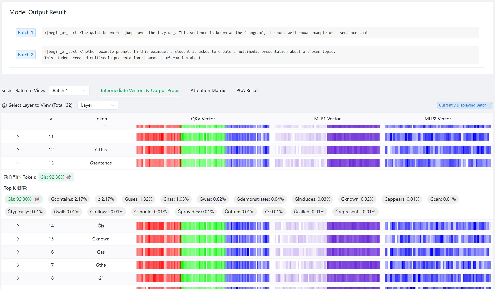
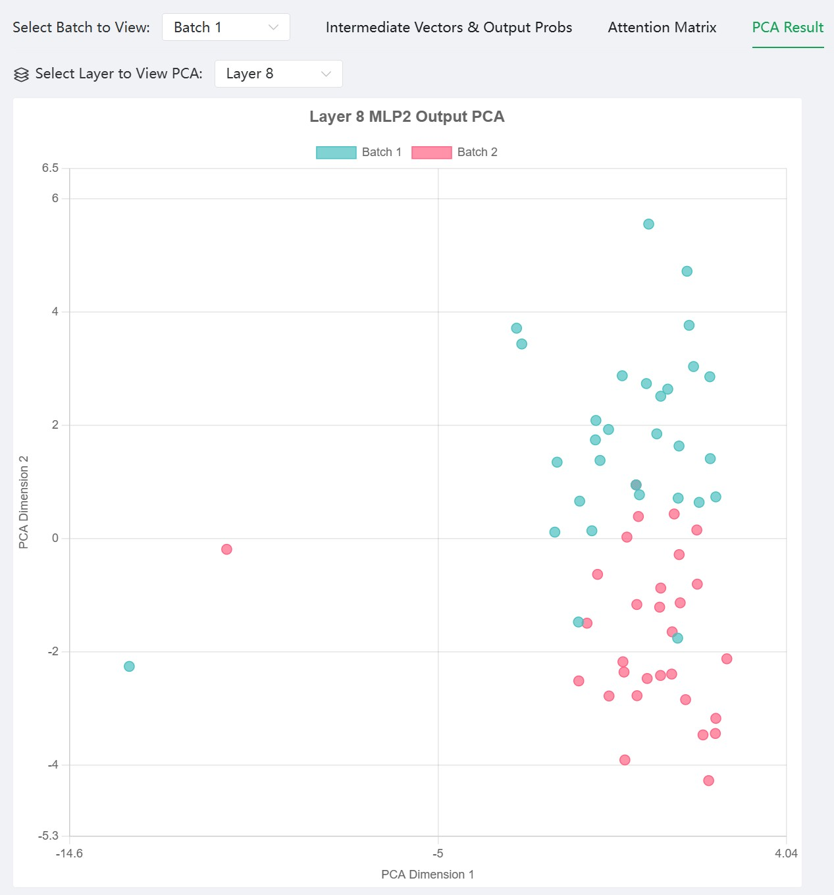

# Quick Start for MegatronApp Docker Usage

This guide gives you a minimal, end-to-end path to run MegatronApp with Docker—just enough to get training and visualization up and running smoothly.

## Docker Installation

We strongly recommend using the official [PyTorch NGC Container]((https://catalog.ngc.nvidia.com/orgs/nvidia/containers/pytorch)). It bundles compatible dependencies and tuned configurations for NVIDIA GPUs.

Our custom environment is based on **nvcr.io/nvidia/pytorch:25.04-py3**.

```
# Run container with mounted directories
docker run --runtime --nvidia --gpus all -it --rm \
  -v /path/to/megatron:/workspace/megatron \
  -v /path/to/dataset:/workspace/dataset \
  -v /path/to/checkpoints:/workspace/checkpoints \
  nvcr.io/nvidia/pytorch:25.04-py3
```

Install any additional Python packages:

```
pip install -r requirements.txt
```

We plan to publish a prebuilt MegatronApp image to a public registry (e.g., Docker Hub) soon.

Note: 

- **Default hardware assumption**: one machine with **4 GPUs**.

- **RDMA C++ extensions**: `shm_tensor_new_rdma` and `shm_tensor_new_rdma_pre_alloc` are only invoked when DPP (Dynamic Pipeline Planning) is enabled. They are primarily used in the `MegaDPP` module (see the references in `megatron/training/training.py`).

- **MegaFBD compatibility**: Although `MegaFBD` doesn’t execute DPP code paths, its installation may prompt you to build the RDMA extensions so imports resolve cleanly. Regular training—including `MegaFBD` —works **without** those extensions. Just ensure no script enables `--use-dpp` or other flags that trigger DPP; otherwise you’ll get runtime errors.

- **MegaScope / MegaScan**: These focus on visualization and slow-node detection rather than core training. You may comment out the RDMA extension lines referenced in [training.py](https://github.com/OpenSQZ/MegatronApp/blob/main/megatron/training/training.py#L120) and still run these components successfully.

### Data Preparation

Below is a minimal example using the GPT samples provided in the repository.

```bash
set -euo pipefail
cd /workspace/megatronapp

# Prepare shared directories (for inputs, outputs, and traces)
mkdir -p /workspace/shared/datasets /workspace/shared/outputs /workspace/shared/traces

# Preprocessed binaries from Megatron’s scripts will be produced here
mkdir -p datasets

# Example: preprocess GPT sample data (datasets_gpt/ and datasets_bert/ provided)
cd /workspace/megatronapp/datasets
python ../tools/preprocess_data.py \
  --input ../datasets_gpt/dataset.json \
  --output-prefix gpt \
  --vocab-file ../datasets_gpt/vocab.json \
  --tokenizer-type GPT2BPETokenizer \
  --merge-file ../datasets_gpt/merges.txt \
  --append-eod \
  --workers "$(nproc)"
```

To use **your own large dataset**, prepare a `.jsonl` file with **one sample per line** and point `--input` to your file path.

Please refer to [README_Megatron.md](https://github.com/OpenSQZ/MegatronApp/blob/main/README_Megatron.md) for more details.

## MegaScan

MegaScan requires enabling trace-related flags during training. Start with the single-node GPT example (easiest to verify).

```bash
cd /workspace/megatronapp

# Define MegaScan related flags
TRACE_FLAGS="\
 --trace \
 --trace-dir trace_output \
 --trace-interval 5 \
 --continuous-trace-iterations 2 \
 --trace-granularity full \
 --transformer-impl local"

bash ./DockerUsage_MegaScan.sh
```

Note: 
- **Single machine, multi-GPU**: If your node has multiple A40s, the script will detect GPU count automatically. To force a value, set `--num-gpus` inside the script to your machine’s GPU count.

- **Multi-node**: Use `run_master_<model>.sh` / `run_worker_<model>.sh` and set `--multi-node` and `--node-ips` (in InfiniBand order) in `examples/.../train_*_master/worker.sh`.

You can also consider **elastic training** (see `torchrun` documentation).

After training, per-rank trace files will be produced in the current directory with names like:

```
benchmark-data-{}-pipeline-{}-tensor-{}.json
```

Aggregate them into one file:

```bash
python scripts/aggregate.py --b trace_output --output benchmark.json
```

To visualize, open the JSON trace with Chrome Tracing (chrome://tracing) or [Perfetto UI](https://ui.perfetto.dev/). You can zoom, filter, and inspect timelines token-by-token to analyze distributed performance.

<p align="center">
  
  
</p>

### Fault Injection (for demonstration)

You can simulate GPU downclocking with `scripts/gpu_control.sh` to illustrate the detection algorithm:

```bash
# Downclock GPU 0 to 900 MHz
bash scripts/gpu_control.sh limit 0 900
```

Re-run training, then aggregate with detection enabled:
    
```bash
python scripts/aggregate.py \
  -b . \  # Equivalent to --bench-dir
  -d      # Enable detection (equivalent to --detect)
```

You should see output indicating a potential anomaly on GPU 0:


## MegaScope

First, we use existed data to launch this example. You need to move `/workspace/megatronapp/datasets` 下的 `gpt_text_document.bin` and `gpt_text_document.idx` to  `/workspace/megatronapp/datasets_gpt`.

MegaScope requires a backend (Megatron) and a frontend (Vue) service.

### Backend(Megatron) Training Mode

```bash
TP=1 PP=2 NNODES=1 NCCL_DEBUG=INFO MASTER_ADDR=127.0.0.1 MASTER_PORT=29500 bash DockerUsage_MegaScope.sh
```

Important: The tutorial defaults to 1 node × 4 GPUs. On your server, set a consistent combination of `TP` (tensor parallel size), `PP` (pipeline parallel size), and `world size`.

After training, list saved checkpoints:

```bash
ls -lah ngc_models/release_gpt_base
```

Expected output (example):

```
total 16K
drwxr-xr-x 3 root root 4.0K Oct 13 12:25 .
drwxr-xr-x 3 root root 4.0K Oct 13 12:05 ..
drwxr-xr-x 4 root root 4.0K Oct 13 12:25 iter_0000020
-rw-r--r-- 1 root root    2 Oct 13 12:25 latest_checkpointed_iteration.txt
```

### Backend (Megatron) Inference Mode

For inference mode, run the text generation server script, pointing it to your model and tokenizer paths, **and make sure to turn on the switch `--enable-ws-server` in the argument**.

```bash
bash examples/inference/a_text_generation_server_bash_script.sh /path/to/model /path/to/tokenizer
```

For example, you can apply and download [Meta-Llama-3-8B-Instruct](https://huggingface.co/meta-llama/Meta-Llama-3-8B-Instruct).

```bash
mkdir -p /workspace/models/llama3_hf
huggingface-cli download meta-llama/Meta-Llama-3-8B-Instruct \
   --local-dir /workspace/models/llama3_hf \
   --local-dir-use-symlinks False
```
Downloading can take a while; ensure you have roughly `40 GB` of free disk space.

Convert the HF checkpoint to `Megatron` format:

```bash
python tools/checkpoint/convert.py \
  --model-type GPT \
  --loader llama_mistral \
  --saver core \
  --checkpoint-type hf \
  --model-size llama3 \
  --load-dir /path/to/Meta-Llama-3-8B-Instruct \
  --save-dir /path/to/Meta-Llama-3-8B-Instruct-megatron \
  --tokenizer-model /path/to/Meta-Llama-3-8B-Instruct/tokenizer.model \
  --bf16
```
其中，
- `--loader` llama_mistral: use the built-in LLaMA/Mistral conversion logic.

- `--checkpoint-type` hf: input is a Hugging Face checkpoint.

- `--model-size`: choose according to the model (e.g., `llama2-7B`, `llama3`, `mistral`).

- Output goes to `--save-dir` and is directly loadable by Megatron inference/training.

During conversion, per-shard read/write progress is printed. When finished, your Megatron checkpoint directory (e.g., `/workspace/models/llama3_megatron`) is ready.

Start the MegaScope inference service:

```bash
bash examples/inference/llama_mistral/run_text_generation_llama3.sh /gfshome/llama3-ckpts/Meta-Llama-3-8B-Instruct-megatron-core-v0.12.0-TP1PP1 /root/llama3-ckpts/Meta-Llama-3-8B-Instruct
```

When the terminal shows **“MegatronServer started”** and a listening **PORT**, the backend is ready.

### Frontend (Vue): Navigate to the frontend directory and start the development server.

```bash
cd transformer-visualize
npm run dev
```
After launching both, open your browser to the specified address (usually http://localhost:5173). You will see the main interface.

#### Generating Text and Visualizing Intermediate States
In the input prompts area, enter one or more prompts. Each text box represents a separate batch, allowing for parallel processing and comparison.


In the control panel, set the desired number of tokens to generate. Also enable or disable the real-time display of specific internal states, such as QKV vectors and MLP outputs. This helps manage performance and focus on relevant data. The filter expressions of vectors can be customized by the input box below.


After starting generation, the visualization results will update token-by-token. In the first tab, the intermediate vector heatmaps are displayed and the output probabilities are shown in the expandable sections.


The second tab contains attention matrices. Use the dropdown menus to select the layer and attention head you wish to inspect.


The third tab is the PCA dimensionality reduction feature where you can visually inspect the clustering of tokens and understand how the model groups similar concepts. The displayed layer can also be selected.


#### Injecting Model Perturbations
The expandable perturbation control panel can introduce controlled noise into the model's forward pass. Each kind of perturbation has an independent switch, controlling the noise type and intensity.

The currently supported noise types include:
- Additive Gaussian Noise (noise1): output = input + N(0, coef²), where N is a random value from a Gaussian (normal) distribution with mean 0.
- Multiplicative Uniform Noise (noise2): output = input * U(1 - val, 1 + val), where U is a random value from a uniform distribution.


#### Support for training process
The similar support for visualization during training process are provided as well. The overall control is the same, and the training process will be controlled on the frontend page. Critical intermediate results and perturbations are supported in training.


### MegaDPP

TBD

### MegaFBD

TBD
