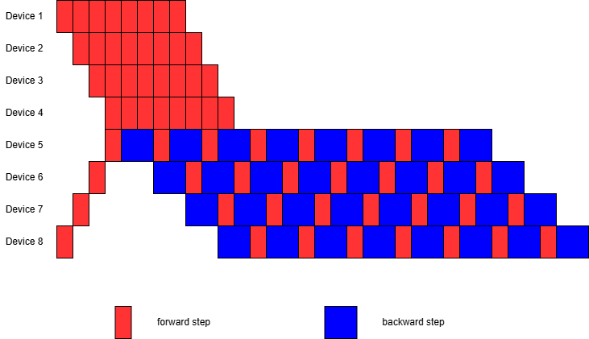
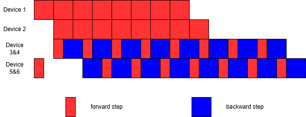

<div align="center">

**Megatron with Forward-Backward disaggregating**

</div>

# 🌟 Overview

$\quad$ The improvement of training steps, which allows ranks to do only forward step or backward step, in another level of parallel.

# ✨ Core Features

- Supports splitting one rank into two ranks: one for forward and one for backward computation.

- Supports merging forward ranks within the same tensor model parallel group.

# 🗺️ Workflow

Each forward rank computes the forward step, and sends the result to the next forward rank and next backward rank.

Each backward rank receives input from last forward rank, recomputes forward step to build computational graph, and proceeds its backward step.

Here's the pipeline of DP=TP=1, PP=4:



Here's the pipeline of DP=1, TP=PP=2, with merging forward ranks:




# 🚀 Quickstart

## Configuration

- The following is the pod configuration.

```yaml
ContainerImage: ngc.nju.edu.cn/nvidia/pytorch:25.03-py3
GPU: RTX4090

Limits:
  CPU: 16
  memory: 200Gi
  GPU: 4
UseShm: true
ShmSize: 16Gi

UseIB: true
```

- The python environment in the image automatically includes almost all of the required packages, to install additional required packages, run

```bash
pip install -r requirements.txt
```

- Install infiniband prerequisites

```bash
bash prerequisite.sh
```

- Build the `shm_tensor_new_rdma` module.

```bash
cd megatron
python setup.py install
```

## Run example

$\quad$ To run distributed training on a single node, go to the project root directory and run

```bash
bash pretrain_gpt.sh $RANK
```

Here pretrain_gpt.sh is an example bash script of pretrain. 

There are two extra options: `--forward-backward-disaggregating` and `--ignore-forward-tensor-parallel` in `TRAINING_ARGS`.

- `--forward-backward-disaggregating`


  Splits each rank into two: one for forward pass and one for backward pass. After doing this, your DP will be halved. Make sure your DP is even before adding this option.

- `--ignore-forward-tensor-parallel`

  Enables merging forward ranks within the same TP group. After doing this, your number of ranks will be multiplied by $\frac{TP+1}{2TP}$. Be sure you are using the correct number of ranks.