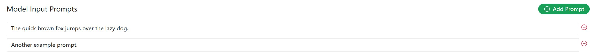
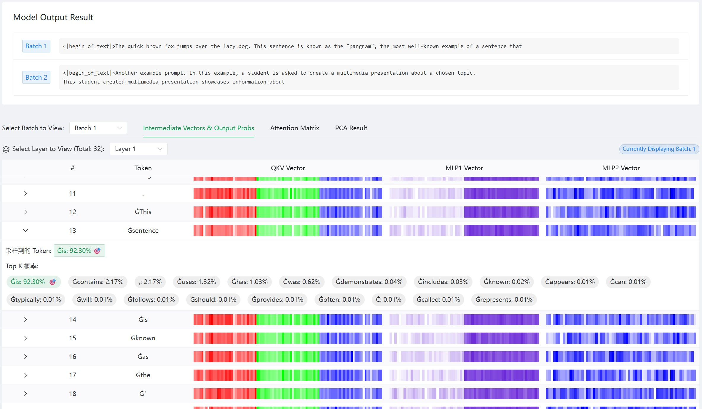

<div align="center">

**MegatronApp: toolchain built around the Megatron-LM for Distributed Training**
<!-- > Sample: AI Health Assistant | Powered by Your Data -->

Extension for performance tuning, slow-node detection, and training-process visualization.

<!-- **📢 Annoncements**  

> List 2~3 important annoncements, including milestones, major releases... -->

<!-- **🌍 Choose Your Language**

[English](README.md)  | [中文](cn/README.md)  -->

</div>

# 🔥 Demo
Insert a product demo.

It is recommended that the demo is within 2mins.

# 🌟 Overview
<!-- TraceMegatron is a tool designed to identify and diagnose performance bottlenecks in distributed training environments, particularly in the context of Megatron-LM. It helps visualize the training process in a global view and gives a heuristic-based algorithm to pinpoint the slowest rank with the most probable cause of the slowdown. This tool is particularly useful for developers and researchers working with large-scale distributed training systems, enabling them to optimize their training processes and improve overall efficiency. -->

MegatronApp is a toolchain built around the Megatron-LM training framework, designed to give practitioners a suite of value-added capabilities such as performance tuning, slow-node detection, and training-process visualization.

The project currently offers four core modules:

- MegaScan is a low-overhead tracing and anomaly detection system designed on Megatron-LM for large-scale distributed training. Detecting and locating hardware performance anomalies, such as GPU downclocking, is extremely challenging in large distributed environments. A single slow GPU can cause a cascading delay, degrading the performance of the entire cluster and making it difficult to pinpoint the source. This module aims to solve this problem by capturing and analyzing runtime trace data. By providing a global, high-precision view of all operations across all GPUs, MegaScan can identify specific patterns caused by hardware anomalies, allowing for accurate detection and root cause localization.
- MegaFBD (Forward-Backward Decoupling) – Automatically splits the forward and backward phases onto different devices to resolve imbalances in compute, communication, and memory usage between the two stages, optimizing resource allocation and boosting overall utilization.
- MegaDPP (Dynamic Pipeline Planning) – Dynamically optimizes pipeline-parallel scheduling during training, allowing each device to adjust its schedule in real time according to progress, deferring selected compute or transfer steps to alleviate network pressure.
- MegaScope – Dynamically captures, processes, and caches intermediate results during training according to user-defined metrics, then displays them through an interactive visualization interface. MegaScope aims to make the "black box" of Large Language Models transparent. With this tool, user can observe and analyze things that happen inside a model as it processes text, such as how attention scores and output probabilities are distributed, how the vector representations change among different tokens and prompts.

The four modules are fully isolated and integrated into the Megatron-LM codebase as plugins; users can flexibly enable or disable any of them at launch via control flags.

# ✨ Core Features
<!-- List 3~5 core features of the project.

> Sample    
> -  📊 Centralized Health Data Input: Easily consolidate all your health data in one place.    
> -  🛠️ Smart Parsing: Automatically parses your health data and generates structured data files.     
> -  🤝 Contextual Conversations: Use the structured data as context for personalized interactions with GPT-powered AI. -->

<!-- - 🔍 **Lightweight Tracing**: Provides detailed tracing of the training process, capturing performance metrics and identifying potential bottlenecks in distributed training environments. 

- 📊 **Global Visualization**: Provides a comprehensive overview of the training process across all ranks, allowing users to visualize the Computation and Communication of distributing training and identify potential bottlenecks.

- 🏎️ **Heuristic-Based Diagnosis**: Implements a heuristic-based algorithm to pinpoint the slowest rank and the most probable cause of the slowdown, enabling fast handling of performance issues. -->

## MegaScan

📊 Low-Overhead Tracing: Utilizes CUDA Events for high-precision, asynchronous timing of operations with minimal impact on training performance (approx. 10% overhead in tests).

🛠️ Automated Data Pipeline: Automatically aggregates trace files from all distributed ranks, reconstructs communication dependencies, and aligns scattered timelines into a single, globally consistent view.

🧠 Heuristic Detection Algorithm: Implements a multi-stage heuristic algorithm to detect and locate faults like GPU downclocking by comparing peer operations across parallel dimensions and analyzing communication behavior.

🖥️ Rich Visualization: Generates trace files in the Chrome Tracing Format, allowing for intuitive, interactive visualization and analysis of complex distributed training runs using standard tools like chrome://tracing and Perfetto UI.

## MegaScope

📊Real-time generation and visualization: Input any prompt and watch the model generate text token by token, with its internal states displayed in sync.

🛠️Intermediate result visualization: 

-  Display key intermediate variables like QKV vectors and MLP layer outputs as heatmaps.
-  Attention matrix analysis: Freely select any layer and attention head to view its dynamic attention weight distribution.
-  Output probability visualization: At each generate-next-token step, show the sampled token and its probability, along with other top-k candidates, revealing the model's decisions.

🧠 Interactive analysis: 

-  A rich set of interactive controls allows users to easily switch between different visualization dimensions.
-  PCA dimensionality reduction: Project high-dimensional vector representations onto a 2D space to analyze the similarities and differences between tokens and prompts.

🖥️ Model perturbation injection: To facilitate in-depth research on model robustness, we provide several model perturbation features.
- Storage perturbation: Inject noise into critical model parameters to simulate the error in storage devices.
- Calculation perturbation: Inject noise during the model's forward pass (e.g. at the output of MLP layer).
- System perturbation: Simulate a constant error between each transformer layer.
Through UI, users can precisely control the location, activation, type and extent of the perturbations.

### MegaDPP

📊 A dynamic pipeline-parallel scheduling algorithm: selects the next microbatch to compute via a customized greedy rule based on user requirements:

- Depth first computation: give priority to computing the same data on different model chunks for lower GPU memory usage
- Breadth first computation: give priority to computing different data on the same model chunks for lower communication contention

🛠️ An efficient  shared-memory based communication library:

- Concurrent asynchronous send/recv operations
- Dynamically track the completion status of operations

### MegaFBD
📊 Instance-Level Decoupled Scheduling: The forward and backward phases are split into two logical processes, each assigned a different rank and bound to separate resources to reduce coupling;

🛠️ Heterogeneous Resource Mapping Optimization: The forward phase can be deployed on lightly loaded devices or CPUs, alleviating GPU pressure;

🧠 Differentiated Parallelism Configuration: Considering factors like activation reuse and communication volume, the forward phase is assigned a lower degree of parallelism to reduce communication overhead;

🖥️ Thread-Level Coordination Mechanism: A communication coordinator ensures necessary data synchronization between forward and backward phases, avoiding deadlocks and redundant communication.


# 🗺️ Tech Architecture / Project Diagram / Workflow
<!-- Illustrate the key technical points with technical architecture, workflow and so on. -->

MegatronApp uses a decoupled frontend-backend architecture with WebSockets to enable low-latency, real-time data communication between the model backend and the visualization frontend.

- Frontend: Based on Vite+Vue+TypeScript, rendering all interactive charts and controls.
- Backend: Based on Megatron, responsible for hosting the LLM. It uses flags to control the extraction of intermediate results during a forward pass, which maintains low time overhead when visualization function is not enabled.
- Communication: The frontend and backend are connected via a WebSocket.


<!-- # 📥 Supported Data Sources & Language Models

| Data Sources You Can Add	| Supported Language Models |
|------------------|--------------------
|xxx	|xxx       |
|xxx	|xxx       | -->

# 🚀 Quickstart
<!-- Include the following information, and provide necessary samples and datasets. You can adjust content based on your project accordingly.

- Install and deploy (lists prerequisites if any)
- Set up and configure (provides examples and datasets if any)
- Build and run
- Access with browser(optional)
- Verify the result -->

To install additional required packages, run

```bash
pip install -r requirements.txt
```

## MegaScan

We provide a basic repro for you to quickly get started with MegaScan.

1. Run Megatron-LM training with MegaScan enabled by adding the following command line arguments:

```bash
--trace
--trace-interval 5 # optional, default is 5 iterations
--continuous-trace-iterations 2 # optional, default is 2 iterations
--transformer-impl local # currently only support local transformer implementation
```

`examples/gpt3/train_gpt3_345m_distributed.sh` is an example script. You can modify the script to suit your needs.

2. After training, you will find separated trace files in the current directory. The trace files are named as `benchmark-data-{}-pipeline-{}-tensor-{}.json`, where `{}` is the rank number. Now we should aggregate the trace files into a single trace file:

```bash
python scripts/aggregate.py --benchmark . --output benchmark.json
```

3. You can visualize the trace file using Chrome Tracing (or Perfetto UI). Open the trace file in Chrome Tracing by navigating to `chrome://tracing` in your browser (or https://ui.perfetto.dev/). Now you can explore the trace data, zoom in on specific events, and analyze the performance characteristics of your distributed training run.


4. To illustrate the detection algorithm, we can manually inject a fault into the training process. We provide a script `scripts/gpu_control.sh` to simulate a GPU downclocking.

    1. Run the script to inject a fault into the training process:

    ```bash
    # Inject a fault into GPU 0, downclocking it to 900MHz
    bash scripts/gpu_control.sh limit 0 900
    ```

    2. Run the training script. Then aggregate the trace files as described above, but with an additional command line argument to enable the detection algorithm:
    
    ```bash
    python scripts/aggregate.py \
        -b . \ # Equivalent to --benchmark
        -d # Enable the detection algorithm, Equivalent to --detect
    ```
    We can see some output that indicated that the GPU 0 may be abnormal:

    

## MegaScope

### 1. Launch the Service
First, start the backend and frontend servers.

**Backend (Megatron)**: For inference mode, run the text generation server script, pointing it to your model and tokenizer paths, **and make sure to turn on the switch `--enable-ws-server` in the argument**.
```bash
bash examples/inference/a_text_generation_server_bash_script.sh /path/to/model /path/to/tokenizer
```
For example
```bash
bash examples/inference/llama_mistral/run_text_generation_llama3.sh /gfshome/llama3-ckpts/Meta-Llama-3-8B-Instruct-megatron-core-v0.12.0-TP1PP1 /root/llama3-ckpts/Meta-Llama-3-8B-Instruct
```
For training mode, run the training script, **and add `--training-ws-port XXX` (e.g. `--training-ws-port 5000`) to the argument**.
For example
```bash
bash pretrain_gpt.sh 0
```

**Frontend (Vue)**: Navigate to the frontend directory and start the development server.
```bash
cd transformer-visualize
npm run dev
```
After launching both, open your browser to the specified address (usually http://localhost:5173). You will see the main interface.

### 2. Generating Text and Visualizing Intermediate States
In the input prompts area, enter one or more prompts. Each text box represents a separate batch, allowing for parallel processing and comparison.


In the control panel, set the desired number of tokens to generate. Also enable or disable the real-time display of specific internal states, such as QKV vectors and MLP outputs. This helps manage performance and focus on relevant data. The filter expressions of vectors can be customized by the input box below.


After starting generation, the visualization results will update token-by-token. In the first tab, the intermediate vector heatmaps are displayed and the output probabilities are shown in the expandable sections.


The second tab contains attention matrices. Use the dropdown menus to select the layer and attention head you wish to inspect.


The third tab is the PCA dimensionality reduction feature where you can visually inspect the clustering of tokens and understand how the model groups similar concepts. The displayed layer can also be selected.


### 3. Injecting Model Perturbations
The expandable perturbation control panel can introduce controlled noise into the model's forward pass. Each kind of perturbation has an independent switch, controlling the noise type and intensity.

The currently supported noise types include:
- Additive Gaussian Noise (noise1): output = input + N(0, coef²), where N is a random value from a Gaussian (normal) distribution with mean 0.
- Multiplicative Uniform Noise (noise2): output = input * U(1 - val, 1 + val), where U is a random value from a uniform distribution.


### 4. Support for training process
The similar support for visualization during training process are provided as well. The overall control is the same, and the training process will be controlled on the frontend page. Critical intermediate results and perturbations are supported in training.


## MegaDPP

### 1. Install

- Install infiniband prerequisites

```bash
bash prerequisite.sh
```

- Build the `shm_tensor_new_rdma_multithread` module.

```bash
cd megatron/shm_tensor_new_rdma_multithread
pip install -e .
```

### 2. Run

$\quad$ To run distributed training on a single node, go to the project root directory and run

```bash
bash run_single.sh
```

note that there is a flag `--use-dpp` in `TRAINING_ARGS`. Remove it to use original pipeline algorithm.

$\quad$ To run distributed training on multi nodes, go to the root directory. First run

```bash
bash run_master.sh
```

and then start another pod and run

```bash
bash run_worker.sh
```

note that remember to change the flag `--node-ips` into the correct infiniband IPs.

### 3. Profiling

$\quad$ Each run will generate a trace dir in `benchmark`. Run

```python
python aggregate.py --benchmark_dir benchmark/your-benchmark-dir
```

in the root dir to produce an aggregated trace file.

## MegaFBD
## Install

- Install infiniband prerequisites

```bash
bash prerequisite.sh
```

- Build the `shm_tensor_new_rdma` module.

```bash
cd megatron
python setup.py install
```

## Run example

$\quad$ To run distributed training on a single node, go to the project root directory and run

```bash
bash pretrain_gpt.sh $RANK
```

Here pretrain_gpt.sh is an example bash script of pretrain. 

There are two extra options: `--forward-backward-disaggregating` and `--ignore-forward-tensor-parallel` in `TRAINING_ARGS`.

- `--forward-backward-disaggregating`


  Splits each rank into two: one for forward pass and one for backward pass. After doing this, your DP will be halved. Make sure your DP is even before adding this option.

- `--ignore-forward-tensor-parallel`

  Enables merging forward ranks within the same TP group. After doing this, your number of ranks will be multiplied by $\frac{TP+1}{2TP}$. Be sure you are using the correct number of ranks.


# 🛠️ Security Policy

If you find a security issue with our project, report the vulnerability privately to [OpenSQZ](mailto:ospo@sqz.ac.cn). It is critical to avoid public disclosure.

An overview of the vulnerability handling process is:

- The reporter reports the vulnerability privately to [OpenSQZ](mailto:ospo@sqz.ac.cn).

- The appropriate project's security team works privately with the reporter to resolve the vulnerability.

- The project creates a new release of the package the vulnerability affects to deliver its fix.

- The project publicly announces the vulnerability and describes how to apply the fix.

# 🚰 Citation
If you use or extend our work, please kindly cite xxx.

# Contributing
Contributions and collaborations are welcome and highly appreciated. Check out the [contributor guide]() and get involved.

# 💡 License
This project is licensed under the Apache 2.0 License, see the LICENSE file for details. 

# 🌐 Community and Support
Provide contact information, including

- Email(user/dev email addresses, with self-subscribe service)
- Discord / Slack
- WeChat / DingTalk
- Twitter / Zhihu...