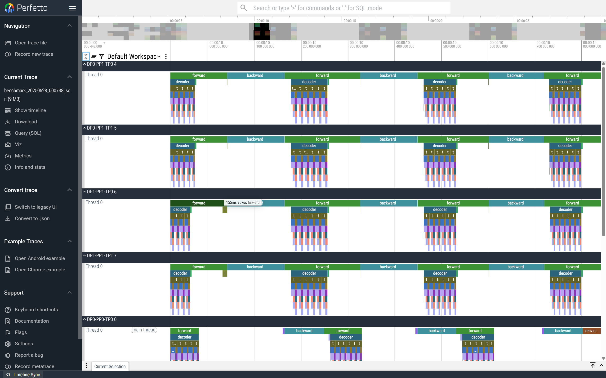
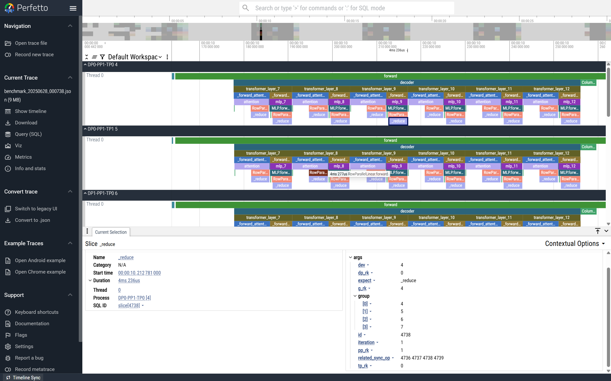

<div align="center">

**DT-Tracer: Anomaly Detection for Distributed Training**
<!-- > Sample: AI Health Assistant | Powered by Your Data -->
Pinpoint the slow rank that may impede overall training efficiency.

<!-- **📢 Annoncements**  
> List 2~3 important annoncements, including milestones, major releases... -->

<!-- **🌍 Choose Your Language**

[English](README.md)  | [中文](cn/README.md)  -->

</div>

# 🔥 Demo
Insert a product demo.

It is recommended that the demo is within 2mins.

# 🌟 Overview
<!-- Briefly introduce the project goal, functionalities, target audience, and background information(e.g., why we build the project).

> Sample    
> OpenHealth helps you take charge of your health data. By leveraging AI and your personal health information, OpenHealth provides a private assistant that helps you better understand and manage your health. You can run it completely locally for maximum privacy. -->

<!-- TraceMegatron is a tool designed to identify and diagnose performance bottlenecks in distributed training environments, particularly in the context of Megatron-LM. It helps visualize the training process in a global view and gives a heuristic-based algorithm to pinpoint the slowest rank with the most probable cause of the slowdown. This tool is particularly useful for developers and researchers working with large-scale distributed training systems, enabling them to optimize their training processes and improve overall efficiency. -->

DT-Tracer is a low-overhead tracing and anomaly detection system designed on Megatron-LM for large-scale distributed training. Detecting and locating hardware performance anomalies, such as GPU downclocking, is extremely challenging in large distributed environments. A single slow GPU can cause a cascading delay, degrading the performance of the entire cluster and making it difficult to pinpoint the source.

This project aims to solve this problem by capturing and analyzing runtime trace data. By providing a global, high-precision view of all operations across all GPUs, DT-Tracer can identify specific patterns caused by hardware anomalies, allowing for accurate detection and root cause localization.

# ✨ Core Features
<!-- List 3~5 core features of the project.

> Sample    
> -  📊 Centralized Health Data Input: Easily consolidate all your health data in one place.    
> -  🛠️ Smart Parsing: Automatically parses your health data and generates structured data files.     
> -  🤝 Contextual Conversations: Use the structured data as context for personalized interactions with GPT-powered AI. -->

<!-- - 🔍 **Lightweight Tracing**: Provides detailed tracing of the training process, capturing performance metrics and identifying potential bottlenecks in distributed training environments. 

- 📊 **Global Visualization**: Provides a comprehensive overview of the training process across all ranks, allowing users to visualize the Computation and Communication of distributing training and identify potential bottlenecks.

- 🏎️ **Heuristic-Based Diagnosis**: Implements a heuristic-based algorithm to pinpoint the slowest rank and the most probable cause of the slowdown, enabling fast handling of performance issues. -->

📊 Low-Overhead Tracing: Utilizes CUDA Events for high-precision, asynchronous timing of operations with minimal impact on training performance (approx. 10% overhead in tests).

🛠️ Automated Data Pipeline: Automatically aggregates trace files from all distributed ranks, reconstructs communication dependencies, and aligns scattered timelines into a single, globally consistent view.

🧠 Heuristic Detection Algorithm: Implements a multi-stage heuristic algorithm to detect and locate faults like GPU downclocking by comparing peer operations across parallel dimensions and analyzing communication behavior.

🖥️ Rich Visualization: Generates trace files in the Chrome Tracing Format, allowing for intuitive, interactive visualization and analysis of complex distributed training runs using standard tools like chrome://tracing and Perfetto UI.

# 🗺️ Tech Architecture / Project Diagram / Workflow
<!-- Illustrate the key technical points with technical architecture, workflow and so on. -->

The system operates through a multi-stage pipeline that processes data from the distributed training job to produce a final analysis report.

Instrumentation: Lightweight instrumentation points are embedded within the Megatron-LM framework to capture the timing of key computation and communication operations using CUDA events.

Trace Collection: Each rank independently generates a local trace file containing its event timeline and metadata.

Aggregation & Alignment: A central script gathers all trace files, reconstructs the dependencies between synchronous operations (e.g., AllReduce), and aligns all local timelines to a single global timeline.

Detection Algorithm: The aligned trace data is fed into the heuristic detection algorithm, which analyzes performance characteristics across data parallel, tensor parallel, and pipeline parallel groups to identify the root cause of any slowdown.

Visualization & Reporting: The system outputs a final trace file in JSON format for visualization and a report indicating the most likely faulty rank(s).

<!-- # 📥 Supported Data Sources & Language Models

| Data Sources You Can Add	| Supported Language Models |
|------------------|--------------------
|xxx	|xxx       |
|xxx	|xxx       | -->

# 🚀 Quickstart
<!-- Include the following information, and provide necessary samples and datasets. You can adjust content based on your project accordingly.

- Install and deploy (lists prerequisites if any)
- Set up and configure (provides examples and datasets if any)
- Build and run
- Access with browser(optional)
- Verify the result -->

We provide a basic repro for you to quickly get started with DT-Tracer.

1. Run Megatron-LM training with DT-Tracer enabled by adding the following command line arguments:

```bash
--trace
--trace-interval 5 # optional, default is 5 iterations
--continuous-trace-iterations 2 # optional, default is 2 iterations
--transformer-impl local # currently only support local transformer implementation
```

`examples/gpt3/train_gpt3_345m_distributed.sh` is an example script. You can modify the script to suit your needs.

2. After training, you will find separated trace files in the current directory. The trace files are named as `benchmark-data-{}-pipeline-{}-tensor-{}.json`, where `{}` is the rank number. Now we should aggregate the trace files into a single trace file:

```bash
python scripts/aggregate.py --benchmark . --output benchmark.json
```

3. You can visualize the trace file using Chrome Tracing (or Perfetto UI). Open the trace file in Chrome Tracing by navigating to `chrome://tracing` in your browser (or https://ui.perfetto.dev/). Now you can explore the trace data, zoom in on specific events, and analyze the performance characteristics of your distributed training run.





4. To illustrate the detection algorithm, we can manually inject a fault into the training process. We provide a script `scripts/gpu_control.sh` to simulate a GPU downclocking.

    1. Run the script to inject a fault into the training process:

    ```bash
    # Inject a fault into GPU 0, downclocking it to 900MHz
    bash scripts/gpu_control.sh limit 0 900
    ```

    2. Run the training script. Then aggregate the trace files as described above, but with an additional command line argument to enable the detection algorithm:
    
    ```bash
    python scripts/aggregate.py \
        -b . \ # Equivalent to --benchmark
        -d # Enable the detection algorithm, Equivalent to --detect
    ```
    We can see some output that indicated that the GPU 0 may be abnormal:

    

    

# 🛠️ Security Policy
If you find a security issue with our project, report the vulnerability privately to [OpenSQZ](mailto:ospo@sqz.ac.cn). It is critical to avoid public disclosure.

An overview of the vulnerability handling process is:

- The reporter reports the vulnerability privately to [OpenSQZ](mailto:ospo@sqz.ac.cn).

- The appropriate project's security team works privately with the reporter to resolve the vulnerability.

- The project creates a new release of the package the vulnerability affects to deliver its fix.

- The project publicly announces the vulnerability and describes how to apply the fix.

# 🚰 Citation
If you use or extend our work, please kindly cite xxx.

# Contributing
Contributions and collaborations are welcome and highly appreciated. Check out the [contributor guide]() and get involved.

# 💡 License
This project is licensed under the Apache 2.0 License, see the LICENSE file for details. 

# 🌐 Community and Support
Provide contact information, including

- Email(user/dev email addresses, with self-subscribe service)
- Discord / Slack
- WeChat / DingTalk
- Twitter / Zhihu...